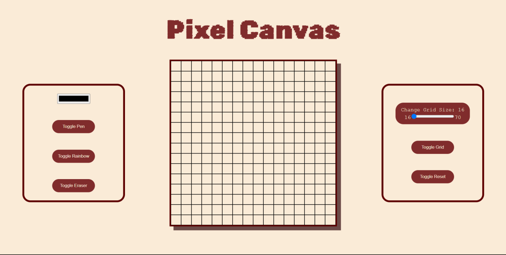

# Pixel-Canvas

Welcome to Pixel Canvas, the place where your creativity takes center stage! Here, you can let your imagination run wild and bring your ideas to life, pixel by pixel. It's a space where innovation flows freely, making creation a fun and accessible journey for everyone. Join us in imagining, creating, and innovating with every pixel!

## Table of Content

- [Live Website](#live-website)
- [Preview](#preview)
- [Features](#features)
- [Technologies Used](#technologies-used)
- [Getting Started](#getting-started)
- [Contributing](#contributing)
- [License](#license)

## Live Website

- Live Preview: [Pixel Canvas](https://rajatthedev.github.io/Pixel-Canvas/)

## Preview

## Features

- **Toggle Pen Mode:** 🖊️ Users can switch to the pen mode, enabling them to draw on the canvas with the chosen color.
- **Color Picker:** 🎨 Integration of a color picker allows users to choose a custom color for the pen tool.
- **Toggle Eraser Mode:** Users can activate the eraser mode with a simple click, allowing them to seamlessly erase pixels on the canvas.
- **Rainbow Drawing Mode:** 🌈 A fun and dynamic rainbow mode for a vibrant and varied drawing experience.
- **Grid Toggle:** Users have the option to toggle the grid on or off for a clearer or more abstract canvas.
- **Grid Size Adjustment:** ↕️ Dynamic grid size adjustment enables users to customize the canvas resolution based on their preferences.
- **Reset Functionality:** 🔄️ A reset button allows users to clear the entire canvas, providing a fresh start for their creative endeavors.

## Technologies Used

- **HTML5:** Used for structuring the content and elements of the web application.
- **CSS:** Applied for styling and enhancing the visual presentation of the Pixel Canvas.
- **JavaScript(JS):**  Empowered the interactivity and dynamic features of the application.

## Getting Started

Follow these steps in order to kickstart your project:

1. Clone the Repository: `git clone git@github.com:RajatTheDev/Pixel-Canvas.git`
2. Open the `index.html` file in your preferred browser to view the content. 🌐

## Contributing

If you have fantastic ideas or improvements to enhance this project, I welcome your contributions! Feel free to fork the repository and submit a pull request to share your insights and make this project even better. Your input is highly valued! 🚀

## License

This project is covered by the [MIT License](LICENSE), which means it's open for collaboration and sharing.